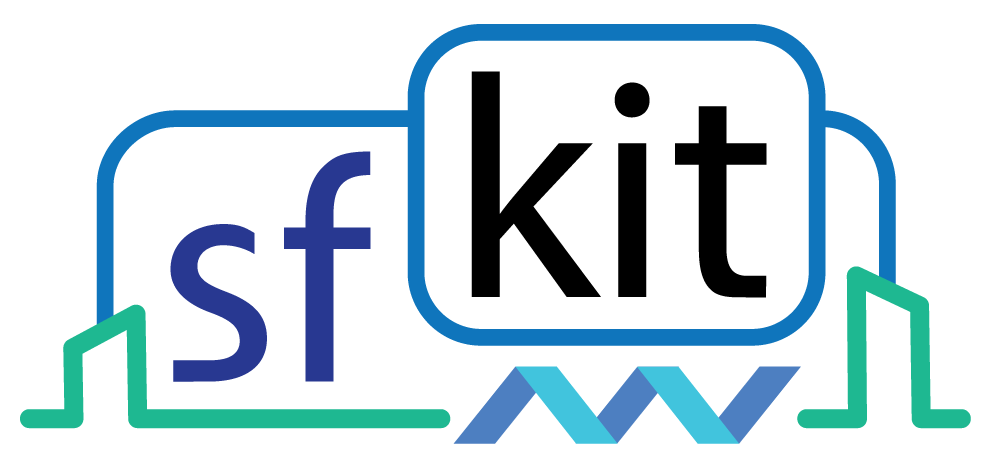

Welcome to the sfkit CLI documentation!
=======================================

**sfkit CLI** is a collection of command line interface (CLI) tools to help run 
privacy-preserving collaborative analyses on genomic data.  
It is a companion to the `sfkit website <https://sfkit.org/>`_.

Check out the :doc:`tutorial` to get started. 

.. note::

   This project is under active development.

Contents
--------

.. toctree::
   :maxdepth: 3

   installation
   tutorial
   workflows
   commands

Questions?
----------
If you have questions or concerns, you can create an issue on the `github repository <https://github.com/simonjmendelsohn/sfkit/issues>`_ or reach me at `smendels@broadinstitute.org <smendels@broadinstitute.org>`_.