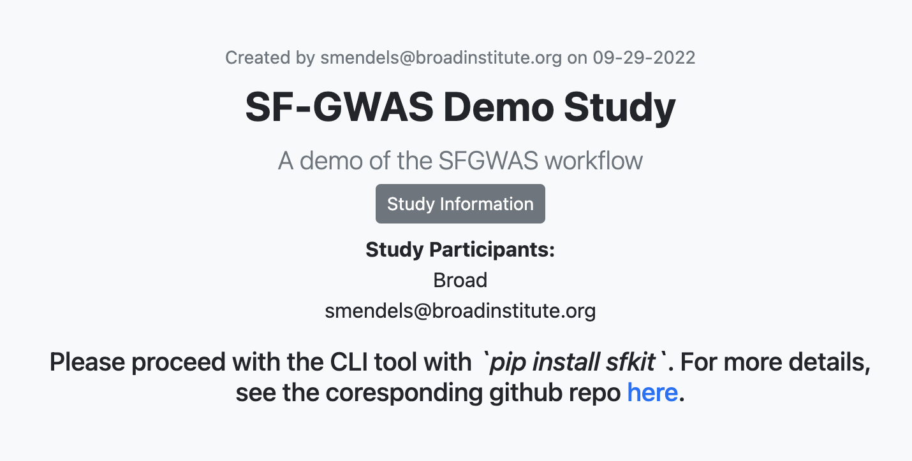

Tutorial
========

Introduction
------------

sfkit is a command line tool made to facilitate secure collaboration for certain types of genomic analysis that utilize potentially sensitive data.  This tutorial will walk you through the steps of using sfkit to perform a secure genome-wide association study (GWAS) using the sfkit workflow.

There are two main components to the sfkit workflow: the website and the sfkit client. The website is a web application that serves to provide a convenient UI for the study participants to create a joint study and set up the study parameters. The sfkit client is a command line tool that is used to perform the actual analysis.  The sfkit CLI is run on a machine controlled by the study coordinator.  The sfkit website is run by the Broad Institute.

Website
-------

1. Go to the companion `website <https://secure-gwas-website-bhj5a4wkqa-uc.a.run.app/>`_ and register or login.  
2. Go to the `studies <https://secure-gwas-website-bhj5a4wkqa-uc.a.run.app/index>`_ page to create a study on the website.  For this tutorial, you should choose the "Secure Federated GWAS Study" workflow.  You can choose to enter any title, description and study information and then click "Submit".  After a few seconds, you should see a page that looks something like this:

.. image:: images/study.png

3. Click on "Configure Study" button, choose "User", and enter the Service Account Email where you are running the workflow.  The Service Account Email is used to validate your GCP VM when it will communicate with the website during the sfkit CLI steps.  The Service Account Email can be obtained by ssh'ing into your GCP VM instance, and then running the command ``gcloud auth list``.  The email address should be listed under the "ACTIVE ACCOUNT" section.  After you have entered the service account email, click "Save Changes".  You should see a page that looks something like this:

You are now done with the website component and can proceed to the CLI. 

.. note::

   When running a real study, you will want to allow multiple participants for a study.  A new participant can request to join a study by clicking "Request to Join Study" under a study on the Studies page.  At that point, the owner of the study will be able to go to their study and click "Approve Request" to allow the participant to join the study. For this tutorial, we will only be using one participant. 

CLI 
---

1. SSH into your VM where you will be running the workflow and follow the instructions to install sfkit if you haven't already (see :doc:`installation`).

2. Run 

.. code-block:: console 
     
    $ sfkit auth

This will authenticate your VM with the website.  It does this by making a get request to the website, which can authenticate you based on the Service Account Email that you provided. If you get an error message, make sure that you have entered the correct Service Account Email in the website.  If you get a message saying "Successfully authenticated!", then you are good to go.

3. Run 

.. code-block:: console 

    $ sfkit networking

This will communicate your IP address to the website so that all study participants will be able to communicate with your VM.  It may also ask your for a preferred port number to use when direct socket connections are made between participants.  If you get a message saying "Successfully communicated networking information!", then you are good to go.

4. Run 

.. code-block:: console 
    
    $ sfkit generate_keys

This will use a secure key generation protocol to generate a pair of keys for your study.  It will also communicate the public key to the website so that all study participants will be able to communicate with your VM.  If you get a message saying "Your public key has been uploaded to the website and is available for all participants in your study.", then you are good to go.  During the actual protocol, your private key (not shared) will be combined with each other participant's public key to a create shared secret key that is only known to you and this other participant.  See `Diffie-Hellman Key Exchange <https://en.wikipedia.org/wiki/Diffie%E2%80%93Hellman_key_exchange>`_ for more information on how this works.

5. Run 

.. code-block:: console 
    
    $ sfkit register_data

This will validate that your input data for the protocol is in the correct format.  It will ask you for the paths to your input data.  For this tutorial, you can enter "demo" and this process will be skipped.  If you get a message saying "Successfully registered and validated data!", then you are good to go.

6. Run 

.. code-block:: console 
    
    $ sfkit run_protocol --demo --phase 1

This will run the first phase of the secure federated gwas protocol.  It should take about 5 minutes.  If you remove the "--phase 1", then it will run the entire protocol, which should take a couple of hours. If you get a message saying "Finished SFGWAS protocol", then it was successful.

.. note::

   If you are running a real study, you will want to run the protocol without the ``--demo`` flag.  If you tried this right now, it would stall with the message "The other participant is not yet ready.  Waiting... (press CTRL-C to cancel)" as it expects another participant to join the study.  

**You have finished the demo!  Go ahead and try this process for a real study.**
