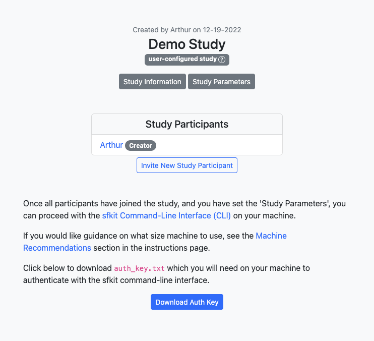

Tutorial
========

Introduction
------------

sfkit is a command line tool made to facilitate secure collaboration for certain types of genomic analysis that utilize potentially sensitive data.  This tutorial will walk you through the steps of using sfkit to perform a secure-federated genome-wide association study (SF-GWAS) using the sfkit workflow.

There are two main components to the sfkit workflow: the website and the sfkit command line interface (CLI). The website is a web application that serves to provide a convenient UI for the study participants to create a joint study and set up the study parameters. The sfkit CLI is a command line tool that is used to perform the actual analysis.  The sfkit CLI is run on a machine controlled by the study participant.  The sfkit website is run by the Broad Institute.

Prerequisites
-------------

Before you begin, you will need access to a machine where you can run the protocol.  If you do not already have a machine set up, the recommended option is to use GCP: if you are unfamiliar with Google Cloud Compute, you may find the documentation `here <https://cloud.google.com/compute>`_.

.. note::

    If you are deciding what Virtual Machine (VM) size you want/need, we generally recommend using the *e2-highmem-16* (16 vCPUs, 128 GB memory) as a reasonable default for this kind of analysis.  This size has worked well for us on datasets with <30,000 samples and <700,000 SNPs for SFGWAS.  If you are running a larger dataset, you may need to increase the size of the VM.  On a dataset with ~10 million SNPs, we have used the larger *n2-highmem-64* or *n2-highmem-128*. If you are running a smaller dataset, you may be able to use a smaller machine.  Feel free to reach out if you have questions or concerns.  

Networking
----------

.. note:: 
    
    When running a real study, you will need to coordinate with the other study participants to set up your networking/firewall such that your machines can communicate with one another.  This may include whitelisting one another's IP addresses on specific ports that you will specify for TCP connections during the course of the protocol.  For the purposes of this tutorial, we will be running the protocol on a single machine, so we will not need to worry about this.

Website
-------

1. Go to the companion `website <https://secure-gwas-website-bhj5a4wkqa-uc.a.run.app/>`_ and register or login.  
2. Go to the `studies <https://secure-gwas-website-bhj5a4wkqa-uc.a.run.app/index>`_ page to create a study on the website.  For this tutorial, you should choose the "Secure Federated GWAS Study" workflow with the "Self-configured" configuration option.  You can choose to enter any title, description and study information and then click "Submit".  You can leave the parameters as they are, for now (when you run a real study, you'll want to set the parameters accordingly). After you submit, you should see a page that looks something like this:

An auth_key.txt should automatically download to your machine.  Once this happens, you can proceed to the CLI. 

.. note::

   When running a real study, you will want to allow multiple participants for a study.  A new participant can request to join a study by clicking "Request to Join Study" under a study on the Studies page.  Alternatively, you can invite a new study participant with the button on your study page.  For this tutorial, we will only be using one participant. 

CLI 
---

1. SSH into your VM where you will be running the workflow and follow the instructions to install sfkit if you haven't already (see :doc:`installation`).  Also download the auth_key.txt to your machine if you have not done so already.

2. Run 

.. code-block:: console 
     
    $ sfkit auth

This will authenticate your VM with the website.  It does this by making a get request to the website, which can authenticate you based on the auth_key that you downloaded.  If you get a message saying "Successfully authenticated!", then you are good to go.

3. Run 

.. code-block:: console 

    $ sfkit networking

This will share your IP address to the website so that all study participants will be able to communicate with your VM.  If you get a message saying "Successfully communicated networking information!", then you are good to go.

.. note:: 
    
    When running a real study (where there are other participants on other machines), it will also ask you for preferred port numbers to use when direct socket connections are made during the protocol.

4. Run 

.. code-block:: console 
    
    $ sfkit generate_keys

This will use a secure key generation protocol to generate a pair of keys for your study.  It will also communicate the public key to the website so that all study participants will be able to communicate with your VM.  If you get a message saying "Your public key has been uploaded to the website and is available for all participants in your study.", then you are good to go.  During the actual protocol, your private key (not shared) will be combined with each other participant's public key to a create shared secret key that is only known to you and this other participant.  See `Diffie-Hellman Key Exchange <https://en.wikipedia.org/wiki/Diffie%E2%80%93Hellman_key_exchange>`_ for more information on how this works.

5. Run 

.. code-block:: console 
    
    $ sfkit register_data

This will validate that your input data for the protocol is in the correct format.  It will ask you for the paths to your input data.  For this tutorial, you can enter "demo" for both data paths and the demo data will be used.  If you get a message saying "Successfully registered and validated data!", then you are good to go.

6. Run 

.. code-block:: console 
    
    $ sfkit run_protocol --demo

This will run the entire secure federated gwas protocol.  It should take about half an hour on the dummy data.  

The output should end something like this: 

.. code-block:: console

    2022/10/04 15:06:21 [watchdog] gc finished; heap watchdog stats: heap_alloc: 817217048, heap_marked: 398932464, next_gc: 797864928, policy_next_gc: 20408608500, gogc: 100
    1!: assoc.go:761 (gwas.(*AssocTest).GetAssociationStats) - 2022-10-04T15:06:22Z Computed stdev
    1!: gwas.go:373 (gwas.(*ProtocolInfo).Phase3) - 2022-10-04T15:06:22Z Finished association tests
    Network log for party 0
    544477704 bytes to party 2
    32 bytes to party 1
    32 bytes from party 1
    16 bytes from party 2
    1!: gwas.go:393 (gwas.(*ProtocolInfo).Phase3) - 2022-10-04T15:06:22Z Output collectively decrypted and saved to: out/party0/assoc.txt
    2022/10/04 15:06:22 [watchdog] gc finished; heap watchdog stats: heap_alloc: 747472368, heap_marked: 373767528, next_gc: 747535056, policy_next_gc: 20373736160, gogc: 100
    2022/10/04 15:06:22 [watchdog] gc finished; heap watchdog stats: heap_alloc: 8488531216, heap_marked: 4422075328, next_gc: 8844150656, policy_next_gc: 24244265584, gogc: 100
    2022/10/04 15:06:26 [watchdog] gc finished; heap watchdog stats: heap_alloc: 8365741616, heap_marked: 4340468136, next_gc: 8680936272, policy_next_gc: 24182870784, gogc: 100
    1!: assoc.go:761 (gwas.(*AssocTest).GetAssociationStats) - 2022-10-04T15:06:28Z Computed stdev
    1!: assoc.go:761 (gwas.(*AssocTest).GetAssociationStats) - 2022-10-04T15:06:28Z Computed stdev
    1!: assoc.go:774 (gwas.(*AssocTest).GetAssociationStats) - 2022-10-04T15:06:30Z All done!
    1!: gwas.go:373 (gwas.(*ProtocolInfo).Phase3) - 2022-10-04T15:06:30Z Finished association tests
    Network log for party 2
    16 bytes to party 0
    2066021021 bytes to party 1
    2052916261 bytes from party 1
    544477704 bytes from party 0
    1!: assoc.go:774 (gwas.(*AssocTest).GetAssociationStats) - 2022-10-04T15:06:30Z All done!
    1!: gwas.go:373 (gwas.(*ProtocolInfo).Phase3) - 2022-10-04T15:06:30Z Finished association tests
    Network log for party 1
    2052913989 bytes to party 2
    32 bytes to party 0
    2066023165 bytes from party 2
    32 bytes from party 0
    2022/10/04 15:06:31 [watchdog] gc finished; heap watchdog stats: heap_alloc: 7554051560, heap_marked: 4316176560, next_gc: 8632353120, policy_next_gc: 23777025756, gogc: 100
    1!: gwas.go:393 (gwas.(*ProtocolInfo).Phase3) - 2022-10-04T15:06:32Z Output collectively decrypted and saved to: out/party2/assoc.txt
    1!: gwas.go:393 (gwas.(*ProtocolInfo).Phase3) - 2022-10-04T15:06:32Z Output collectively decrypted and saved to: out/party1/assoc.txt
    Finished SFGWAS protocol

And if you look in the sfgwas/out/party1 directory, you should see a file called assoc.txt that looks something like this:

.. code-block:: console

    smendels@simon-0:~$ head sfgwas/out/party1/assoc.txt
    2.214016e-02
    4.138482e-03
    -3.585493e-02
    -6.841428e-03
    2.023826e-02
    1.094795e-03
    4.876583e-02
    1.222332e-02
    -7.845751e-03
    8.301471e-04

.. note::

   If you are running a real study, you will want to run the protocol without the ``--demo`` flag.  If you tried this right now, it would stall with the message "The other participant is not yet ready.  Waiting... (press CTRL-C to cancel)" as it expects another participant to join the study.  

**Click "Next" to go to the Workflows page and read more details on what run_protocol is doing!**
