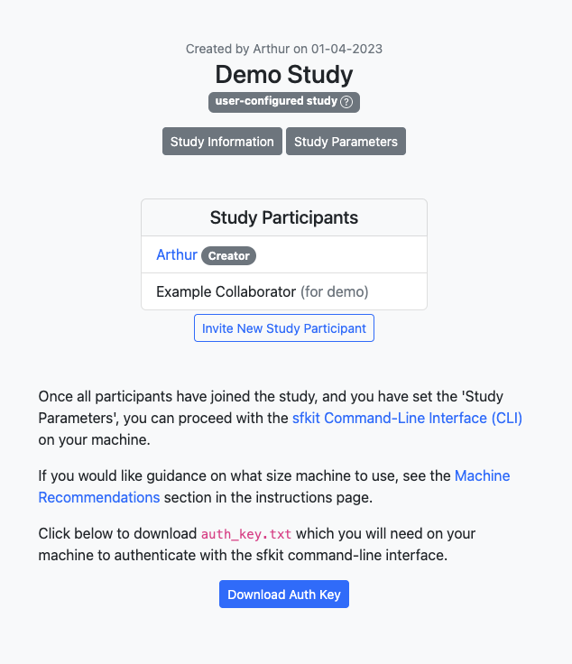

Tutorial 1 (Quick test for one user)
====================================

Introduction
------------

sfkit is a command line tool made to facilitate secure collaboration for 
genomic analysis. It allows a group of researchers to jointly analyze
their private datasets without sharing any sensitive data among them.
This tutorial will walk you through the steps of using sfkit to perform a 
secure and federated genome-wide association study (GWAS) using the sfkit workflow.  
That said, this same tutorial can be run with any of the workflows.  

There are two main components to the sfkit workflow: the website and the sfkit command line interface (CLI). 
The website is a web application that serves to provide a convenient UI for the study participants to 
create a joint study and set up the study parameters. The sfkit CLI is a command line tool that is 
used to perform the actual analysis.  The sfkit CLI is run on a machine controlled by the study participant. 

.. note::

    There is also a website-only *auto-configured* version of this tutorial available at `sfkit.org/tutorial <https://sfkit.org/tutorial>`_.

Prerequisites
-------------

Before you begin, you will need access to a machine where you can run the protocol. 
If you do not already have a machine set up, the recommended option is to use Google Cloud Platform (GCP):
if you are unfamiliar with GCP, you may find the documentation `here <https://cloud.google.com/compute>`_ helpful.

.. note::

    If you are deciding what Virtual Machine (VM) size to use, 
    we generally recommend using the *e2-highmem-16* (16 vCPUs, 128 GB memory) 
    with at least a *100GB boot disk* as a reasonable default for this kind of analysis.  
    This size has worked well for us on datasets with <30,000 samples and <700,000 SNPs for SF-GWAS. 
    If you are running a larger dataset, you may need to increase the size of the VM.  
    On a dataset with ~10 million SNPs, we have used the larger *n2-highmem-64* or *n2-highmem-128*
    with a 500GB disk. If you are running a smaller dataset, you may be able to use a smaller machine.  
    Feel free to reach out if you have questions.

Networking
----------

.. note:: 
    
    When running a real study, you will need to coordinate with the other study collaborators 
    to set up your networking and firewall rules such that your machines can communicate with one another. 
    This may include whitelisting one another's IP addresses on specific ports that you will specify for 
    TCP connections during the course of the protocol.  For the purposes of this tutorial,
    we will be running the protocol on a single machine, so we will not need to worry about this.

Website
-------

1. Go to the companion `website <https://sfkit.org/>`_ and register or login.  
2. Go to the `studies <https://sfkit.org/index>`_ page to create a study on the website.  For this tutorial, you should choose the "SF-GWAS" workflow with the "user-configured" option.  You can choose to enter any title, description and study information and then check "Demo Study" and Confirm.  You can leave the parameters as they are, for now (when you run a real study, you'll want to set the parameters accordingly). After you submit, you should see a page that looks something like this:

You should click the button to download the the Auth key, and then you should upload it to the machine where you will be running the protocol. (You can put this key anywhere you want; you will be asked for the path when you authenticate with `sfkit auth`.)

.. note::

   When running a real study, you will want to allow multiple participants for a study.  A new participant can request to join a study by clicking "Request to Join Study" under a study on the Studies page.  Alternatively, you can invite a new study participant with the button on your study page.  For this tutorial, we have automaticaly added an "Example Collaborator" to imitate another study participant.

CLI 
---

0. SSH into your VM where you will be running the workflow and follow the instructions to install sfkit if you haven't already (see :doc:`installation`).  Also upload the auth_key.txt to your machine if you have not done so already.

1. Run

.. tab:: pip

    .. code-block:: console

        $ sfkit auth

.. tab:: docker

    .. code-block:: console

        $ docker run --rm -it --pull always \
            -v $HOME/.config:/home/nonroot/.config \
            -v $PWD/auth_key.txt:/app/auth_key.txt:ro \
            ghcr.io/hcholab/sfkit auth

    Note that this assumes your auth_key.txt is in the current directory.  If it is not, you will need to change the path accordingly.  See :doc:`installation` for more information on running sfkit with docker.

This will authenticate your VM with the website. It does this by making a request to the website, which can authenticate you based on the key that you downloaded. If you get a message saying "Successfully authenticated!", then you are good to go.

2. Run 

.. tab:: pip

    .. code-block:: console

        $ sfkit networking

.. tab:: docker

    .. code-block:: console

        $ docker run --rm -it --pull always \
            -v $HOME/.config:/home/nonroot/.config \
            ghcr.io/hcholab/sfkit networking 

This will share your IP address to other study participants so their machines can communicate with your VM.  In this one-person tutorial, it will do nothing. If you get a message saying "Successfully communicated networking information!", then you are good to go.

.. note:: 
    
    When running a real study (where there are other participants on other machines), it will also ask you for preferred port numbers to use when direct socket connections are made during the protocol. This port number (and optionally a custom IP address) can also be set via the `--ports` and `--ip_address` flags.  You will need to coordinate with the other study participants to ensure that you are not using the same port numbers as one another.  You will also need to ensure that your firewall rules allow for TCP connections on these ports.  

3. Run 

.. tab:: pip

    .. code-block:: console

        $ sfkit generate_keys

.. tab:: docker

    .. code-block:: console

        $ docker run --rm -it --pull always \
            -v $HOME/.config:/home/nonroot/.config \
            ghcr.io/hcholab/sfkit generate_keys

This will use a secure key generation protocol to generate a pair of keys for your study.  It will also communicate the public key to the website so that all study participants will be able to communicate with your VM.  If you get a message saying "Your public key has been uploaded to the website and is available for all participants in your study.", then you are good to go.  During the actual protocol, your private key (not shared) will be combined with each other participant's public key to a create shared secret key that is only known to you and this other participant.  See `Diffie-Hellman Key Exchange <https://en.wikipedia.org/wiki/Diffie%E2%80%93Hellman_key_exchange>`_ for more information on how this works.

4. Run 

.. tab:: pip

    .. code-block:: console

        $ sfkit register_data

.. tab:: docker

    .. code-block:: console

        $ docker run --rm -it --pull always \
            -v $HOME/.config:/home/nonroot/.config \
            -v $PWD/data:/app/data \
            ghcr.io/hcholab/sfkit register_data

    Note that this assumes your data is in a directory called "data" in the current directory.  If it is not, you will need to change the path accordingly.  See :doc:`installation` for more information on running sfkit with docker.

This will validate that your input data for the protocol is in the correct format.  It will ask you for the paths to your input data (this can also be provided via command-line arguments).  For this tutorial, you can enter "demo" for both data paths and the demo data will be used.  If you get a message saying "Successfully registered and validated data!", then you are good to go.

.. note::
    
    When running the MPC-GWAS workflow, this step will also encrypt your data. This means that your full raw data is *not* necessary for the final `sfkit run_protocol` step if you prefer to remove it from your machine or run the protocol on a different machine. Of course, you will need to keep the encrypted data on your machine for the duration of the protocol.

5. Run 

.. tab:: pip

    .. code-block:: console

        $ sfkit run_protocol

.. tab:: docker

    .. code-block:: console

        $ docker run --rm -it --pull always \
            -v $HOME/.config:/home/nonroot/.config \
            -v $PWD/data:/app/data \
            -p 8100-8120:8100-8120 \
            ghcr.io/hcholab/sfkit run_protocol

    Note that this assumes your data is in a directory called "data" in the current directory.  It also assumes that you chose port 8100 in the `networking` step.  See :doc:`installation` for more information on running sfkit with docker.

This will run the entire secure federated gwas protocol.  It should take about half an hour on the toy example dataset.  

The output should look something like this: 

.. code-block:: console

    2022/10/04 15:06:21 [watchdog] gc finished; heap watchdog stats: heap_alloc: 817217048, heap_marked: 398932464, next_gc: 797864928, policy_next_gc: 20408608500, gogc: 100
    1!: assoc.go:761 (gwas.(*AssocTest).GetAssociationStats) - 2022-10-04T15:06:22Z Computed stdev
    1!: gwas.go:373 (gwas.(*ProtocolInfo).Phase3) - 2022-10-04T15:06:22Z Finished association tests
    Network log for party 0
    544477704 bytes to party 2
    32 bytes to party 1
    32 bytes from party 1
    16 bytes from party 2
    1!: gwas.go:393 (gwas.(*ProtocolInfo).Phase3) - 2022-10-04T15:06:22Z Output collectively decrypted and saved to: out/party0/assoc.txt
    2022/10/04 15:06:22 [watchdog] gc finished; heap watchdog stats: heap_alloc: 747472368, heap_marked: 373767528, next_gc: 747535056, policy_next_gc: 20373736160, gogc: 100
    2022/10/04 15:06:22 [watchdog] gc finished; heap watchdog stats: heap_alloc: 8488531216, heap_marked: 4422075328, next_gc: 8844150656, policy_next_gc: 24244265584, gogc: 100
    2022/10/04 15:06:26 [watchdog] gc finished; heap watchdog stats: heap_alloc: 8365741616, heap_marked: 4340468136, next_gc: 8680936272, policy_next_gc: 24182870784, gogc: 100
    1!: assoc.go:761 (gwas.(*AssocTest).GetAssociationStats) - 2022-10-04T15:06:28Z Computed stdev
    1!: assoc.go:761 (gwas.(*AssocTest).GetAssociationStats) - 2022-10-04T15:06:28Z Computed stdev
    1!: assoc.go:774 (gwas.(*AssocTest).GetAssociationStats) - 2022-10-04T15:06:30Z All done!
    1!: gwas.go:373 (gwas.(*ProtocolInfo).Phase3) - 2022-10-04T15:06:30Z Finished association tests
    Network log for party 2
    16 bytes to party 0
    2066021021 bytes to party 1
    2052916261 bytes from party 1
    544477704 bytes from party 0
    1!: assoc.go:774 (gwas.(*AssocTest).GetAssociationStats) - 2022-10-04T15:06:30Z All done!
    1!: gwas.go:373 (gwas.(*ProtocolInfo).Phase3) - 2022-10-04T15:06:30Z Finished association tests
    Network log for party 1
    2052913989 bytes to party 2
    32 bytes to party 0
    2066023165 bytes from party 2
    32 bytes from party 0
    2022/10/04 15:06:31 [watchdog] gc finished; heap watchdog stats: heap_alloc: 7554051560, heap_marked: 4316176560, next_gc: 8632353120, policy_next_gc: 23777025756, gogc: 100
    1!: gwas.go:393 (gwas.(*ProtocolInfo).Phase3) - 2022-10-04T15:06:32Z Output collectively decrypted and saved to: out/party2/assoc.txt
    1!: gwas.go:393 (gwas.(*ProtocolInfo).Phase3) - 2022-10-04T15:06:32Z Output collectively decrypted and saved to: out/party1/assoc.txt
    Finished SF-GWAS protocol

And if you look in the sfgwas/out/party1 directory, you should see a file called assoc.txt that looks something like this:

.. code-block:: console

    smendels@simon-0:~$ head sfgwas/out/party1/assoc.txt
    #CHROM	POS	R	LOG10P
    1	10000	0.02240129	-0.49905497629788775
    1	20000	0.003412083	-0.05607581566922004
    1	30000	-0.03598186	-0.9674039445847216
    1	40000	-0.006283264	-0.10847440540850205
    1	50000	0.02135239	-0.4683696638454863
    1	60000	0.0002090347	-0.0032473610465469987
    1	70000	0.04874529	-1.5335656035638792
    1	80000	0.01069461	-0.19869300651888114

Congratulations! You have successfully completed the *user-configured* Tutorial 1.  You should have a better understanding of how to confiugre and execute a study using sfkit. Feel free to explore other workflows and data types or to use the platform for your own research projects.  We also encourage you to go through Tutorial 2, which will show you haow to run a study with multiple participants. 
